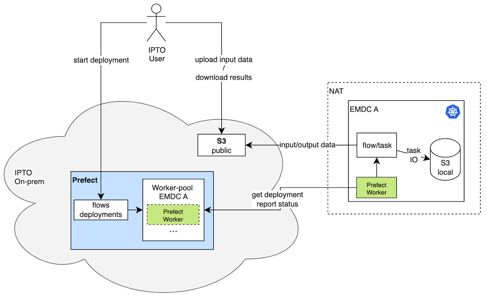

# ACES Workflow Management

The diagram below illustrates the architecture of the ACES Workflow Management
system which is based on the Prefect framework.



## Installation

### Prerequisites

- Cloud and Edge Kubernetes clusters
- `kubectl` configured to access the clusters
- `helm` installed and configured to access the clusters

### Deploy MinIO Operator & MinIO Tenant on Cloud and Edge Clusters

The MinIO will be used on the cloud cluster to store:

* input and output data of Prefect flows.

The MinIO will be used on the edge cluster to store:

* intermediate results of Prefect flow tasks.

NB! MinIO credentials are set to `admin/martel2024`.

```shell
cd deployment/minio
```

Configure `KUBECONFIG` to point to your cloud or edge clusters accordingly and
then run the automated deployment script that handles everything:

```shell
./deploy-minio.sh
```

Follow the instructions at the end of the script to complete the deployment.

Use `mc` to create the `prefect` bucket and set it to public.

```shell
kubectl apply -f s3-add-bucket-prefect-job.yaml
```

Alternatively, you can use Nuvla to deploy MinIO for Prefect with local path
storage. Deploy the applications in the following order.

1. Local Path Storage: https://nuvla.io/ui/apps/aces/edge-cloud-infrastructure/workflow-management/minio-for-prefect/local-path-storage
2. MinIO Operator: https://nuvla.io/ui/apps/aces/edge-cloud-infrastructure/workflow-management/minio-for-prefect/minio-operator
3. MinIO Tenant: https://nuvla.io/ui/apps/aces/edge-cloud-infrastructure/workflow-management/minio-for-prefect/minio-tenant
4. Add the `aces` bucket to the MinIO tenant: https://nuvla.io/ui/apps/aces/edge-cloud-infrastructure/workflow-management/minio-for-prefect/aces-bucket-in-minio/

If you need to cleanup after terminating the deployment, you can delete the
MinIO related resources using:

```shell
kubectl delete crd tenants.minio.min.io policybindings.sts.min.io --ignore-not-found 
kubectl delete clusterrole minio-operator-role --ignore-not-found
kubectl delete clusterrolebinding minio-operator-role-binding --ignore-not-found
kubectl delete clusterrolebinding minio-operator-binding --ignore-not-found
```

### Deploy Prefect Server on Cloud or on-premises

The following explains how to deploy Prefect Server with PostgreSQL.

Deploy using Nuvla:

https://nuvla.io/ui/apps/aces/edge-cloud-infrastructure/workflow-management/prefect

Alternatively, deploy using CLI script:

```shell
cd deployment/prefect/server
./deploy-prefect-server.sh
```

Validate the the server is running

```shell
$ kubectl -n prefect get pods
NAME                              READY   STATUS    RESTARTS        AGE
prefect-server-6b7b745577-7z2w4   1/1     Running   0               2d12h
prefect-server-postgresql-0       1/1     Running   0               2d12h
```

For accessing Prefect UI and API from outside the cluster, you can use
port-forwarding.

```shell
kubectl -n prefect port-forward svc/prefect-server 4200:4200 --address=0.0.0.0
```

To validate Prefect is available, run

```shell
export PREFECT_API_URL="http://<hostname|IP>:4200/api"
prefect version
```

You can also test the connection with:

```shell
prefect config view
```

To access UI create a tunnel to the Prefect server. From your local machine, run

```shell
ssh -L 4200:localhost:4200 root@<hostname|IP> -N

```

Then, from your local machine, access the Prefect UI at `http://localhost:4200`.

### Set up Prefect Block K8SJob and Work Pool

The following approach to data management for Prefect flows was taken:

* Cloud S3 (“minio-data”, “minio-results”) holds inputs/outputs. Edge
flows pull inputs from Cloud S3 and push final results back. This centralizes
artifacts and simplifies discovery and governance.

* Edge‑local S3 for intermediate/ephemeral artifacts and parameter exchange
reduces egress, latency, and avoids pushing large intermediates to the cloud
unnecessarily.

See the conceptual diagram above with *S3 public* and *S3 local* storage respectively.

Follow the instructions in this [README.md](deployment/prefect/config-pools-storage/README.md).


### Deploy Prefect Worker

The Prefect Worker is intended to be deployed on K8s clusters on edge devices.
It, then connects to the Prefect Server to a predefined pool and listens to the
actions to execute.

Deploy Prefect Worker on the edge devices using Nuvla:

https://nuvla.io/ui/apps/aces/edge-cloud-infrastructure/workflow-management/prefect-worker

After that deploy the K8s ServiceAccount to be able to deploy K8s flows:

https://nuvla.io/ui/apps/aces/edge-cloud-infrastructure/workflow-management/prefect-worker-serviceaccount

### Test

This will:

* Register the deployment to the `aces` pool
* Create it under the name `hello-deployment`
* Use the flow defined in `hello_flow.py:hello`

Make sure your Prefect server is configured and reachable by running

```shell
$ prefect config view
🚀 you are connected to:
http://localhost:4200
PREFECT_PROFILE='ephemeral'
PREFECT_API_URL='http://localhost:4200/api' (from env)
PREFECT_SERVER_ALLOW_EPHEMERAL_MODE='true' (from profile)
$
```

```shell
cd tests
python hello_flow.py
```

List the deployments

```shell
prefect deployment ls
```

And trigger a run:

```shell
prefect deployment run hello/hello-deploy
```

## Deploy IPTO flows in ACES Workflow Orchestrator

### UC1 - Load Sensitivity Analysis

Deploy the UC1 Load Sensitivity Analysis flow with MinIO integration:

```shell
cd IPTO/UC1/uc1_prefect
python flow_with_minio.py  # Deploy the flow
```

This will create a deployment named `uc1-load-sensitivity-minio` that:

- Loads input data from MinIO (if any)
- Runs the load sensitivity analysis 
- Saves all output files (Excel, PNG plots) to MinIO storage
- Stores intermediate results in MinIO

Run the deployment:

```shell
prefect deployment run uc1-load-sensitivity-analysis/uc1-load-sensitivity-minio
```

### User Workload Deployment Guide

For users deploying their own workloads, see the comprehensive [MinIO Integration Guide](MINIO_INTEGRATION_GUIDE.md) which covers:

- How to configure flows to use MinIO for input/output files
- Different deployment methods (local code vs. MinIO-stored code)
- Best practices for file organization
- Example code for common patterns
- Troubleshooting guide

#### Quick Example for User Workloads

```python
from prefect import flow, task
from prefect_aws import S3Bucket

@task
def load_data(input_path: str):
    storage = S3Bucket.load("minio-data-storage")
    local_path = storage.download_object_to_path(input_path, "temp_input.csv")
    # Process your data
    local_path.unlink()  # Clean up

@task  
def save_results(data, output_path: str):
    storage = S3Bucket.load("minio-data-storage")
    # Save data locally first, then upload
    storage.upload_from_path("local_file.csv", output_path)

@flow(result_storage="s3-bucket/minio-result-storage")
def my_workload():
    data = load_data("input/my_data.csv")
    # Your processing...
    save_results(data, "output/my_results.csv")

if __name__ == "__main__":
    my_workload.deploy(
        name="my-workload",
        work_pool_name="aces",
        job_variables={"env": {"EXTRA_PIP_PACKAGES": "prefect-aws s3fs pandas"}}
    )
```
